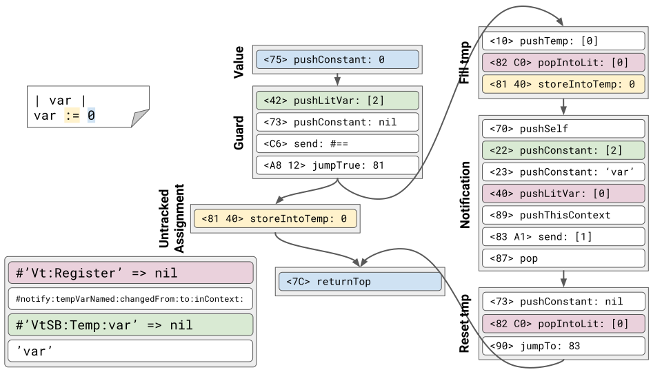

# VarTra - Squeak Variable Tracking [![Build Status][travis_b]][travis_url] [![Coverage Status][coveralls_b]][coveralls_url]
VarTra (from **Var**iable **Tra**cking) is a low-performance-impact mechanism to synchronousuly react to variable assignments in [Squeak/Smalltalk][Squeak]. It uses an altered compilation process to inline notification code around all variable assignments. To ensure that the transformed code is minimally expensive, VarTra emits optimized bytecode for its instrumented assignments.

Supported variable types:
  * Instance variables
  * Temporary variables
  * Literal variables (class, global, shared pools).

## Installation
> **WARNING! This project overrides system methods to change the default compilation process.**

> A successful installation involves recompilation of all methods within your image.

> [Check Travis][travis_url] to see whether your version of Squeak is supported.

### Option 1: Metacello

1. Make sure to have [Metacello] installed.
2. Then you can use the following code to load VarTra and all its prerequisites:
    ```smalltalk
    Metacello new
      baseline: 'VarTra';
      repository: 'github://stlutz/VarTra/src';
      load.
    ```

### Option 2: Git Browser
> Only for Squeak 5.2 and newer

1. Make sure to have [Squot] installed
    ```smalltalk
    Installer installGitInfrastructure.
    ```
2. [Clone this repository](https://github.com/hpi-swa/Squot#getting-started-with-an-existing-remote-project)

### Option 3: Monticello
1. Make sure to have [FileTree] installed
2. Clone this repository somewhere on your file system
3. Add the `src/` folder of this repository as a `filetree://` repository
4. Load the individual packages via Monticello in the following order:
    1. (If you use a Squeak older than 5.2:) `VarTra-Compat51-Compiling`
    2. `VarTra-Compiling`
    3. `VarTra-Core`
    4. `VarTra-Tests`

## Usage
```smalltalk
"Activate variable tracking and recompile all methods with it."
VarTra install.

"Deactivate variable tracking and recompile all methods to remove it."
VarTra uninstall.

"Subscribe to changes of a variable"
VarTra subscribe: self toInstVarNamed: 'instVar' ofObject: VtMockInstVarPublisher new.
VarTra subscribe: self toLitVar: (self environment bindingOf: #VtMockGlobal).
VarTra subscribe: self toTempVarNamed: 'tempVar' ofContext: thisContext.

"Unsubscribe from variable changes"
VarTra unsubscribe: self fromInstVarNamed: 'instVar' ofObject: anObject.
VarTra unsubscribe: self fromLitVar: (self environment bindingOf: #VtMockGlobal).
VarTra unsubscribe: self fromTempVarNamed: 'tempVar' ofContext: thisContext.

"When a variable changes, its subscribers are notified via a message send.
To react, subclasses of Object need to override the respective methods."
Object >> #'instVarNamed:ofObject:changedFrom:to:inContext:'.
Object >> #'litVar:changedFrom:to:inContext:'.
Object >> #'tempVarNamed:changedFrom:to:inContext:'.
```

## Tracking Mechanism

To be notified of variable assignments, VarTra emits modified bytecodes for variable assignments. It does so by parsing assignments as [VtTrackedAssignmentNode]s, a subclass of the normal AssignmentNode. The actual injection of instrumentation code then happens during bytecode generation.

More details can be found [here][slides].

### Example


<!-- References -->
[travis_b]: https://travis-ci.org/stlutz/VarTra.svg?branch=master
[travis_url]: https://travis-ci.org/stlutz/VarTra
[coveralls_b]: https://coveralls.io/repos/github/stlutz/VarTra/badge.svg?branch=master
[coveralls_url]: https://coveralls.io/github/stlutz/VarTra?branch=master

[Squeak]: https://squeak.org
[Metacello]: https://github.com/Metacello/metacello
[Squot]: https://github.com/hpi-swa/Squot
[FileTree]: https://github.com/dalehenrich/filetree

[initialization]: ./src/VarTra-Core.package/VarTra.class/class/initialize.st
[compiler]: ./src/VarTra-Compiling.package/VtCompiler.class/README.md
[VtTrackedAssignmentNode]: ./src/VarTra-Compiling.package/VtTrackedAssignmentNode.class/README.md
[VarTra]: ./src/VarTra-Core.package/VarTra.class/README.md
[VarTra-Compiling]: ./src/VarTra-Compiling.package/

[slides]: https://docs.google.com/presentation/d/192mTiLdjXIYPYmPimv9NPurkuOEgPnL-i54dnxDReaU/edit?usp=sharing